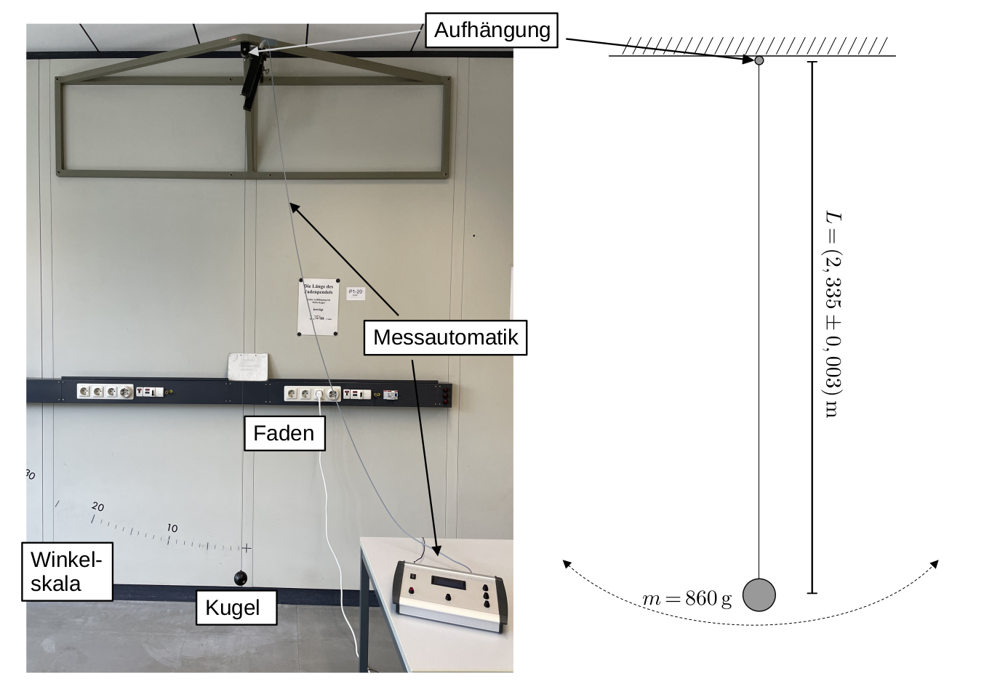

# Fakultät für Physik 

## Physikalisches Praktikum P1 für Studierende der Physik

Versuch P1-20, 21, 22 (Stand: November 2022)

[Raum F1-11](http://www-ekp.physik.uni-karlsruhe.de/~simonis/praktikum/layoutobjekte/Lageplan_P1.png)

# Pendel

## Motivation

Schwingungen sind überall in der Natur auftretende Bewegungsformen und deshalb in der Physik sehr wichtig. Bei diesem Versuch geht es um mechanische Schwingungen. Er bietet die Gelegenheit, sich mit einigen Schwingungsaspekten sowie einigen Problemen der Bewegung starrer Körper vertraut zu machen. 

Oft werden beim Experimentieren die Versuchsbedingungen so eingerichtet, dass die mathematischen Lösungen der beobachteten Prozesse harmonische Schwingungen sind. Dies ist in der Natur im allgemeinen nicht der Fall. Dass es sich dabei um ein Verhalten unter besonderen Laborbedingungen handelt, von dem schnell erhebliche Abweichungen auftreten können, soll aus diesem Versuchen ebenfalls hervorgehen.

## Anmerkungen zum Versuch Pendel

Wir listen im Folgenden die wichtigsten **Lernziele** auf, die wir Ihnen mit dem Versuch **Pendel** vermitteln möchten: 

- Sie lernen den Umgang mit einigen der wichtigsten mechanischen Systeme kennen, mit deren Hilfe man Schwingungsphänomene experimentell studieren kann. 
- Sie lernen den nicht immer intuitiven Einfluss der endlichen Ausdehnung physikalischer Körper auf die Bewegung der untersuchten Pendel kennen.
- Sie üben sich anhand der einfachen Aufbauten im sorgfältigen Experimentieren und Messen unter Laborbedingungen.
- Sie lernen den Nutzen redundanter und alternativer Messmethoden kennen und lernen die Vor- und Nachteile einzelner Bestimmungen der verschiedenen physikalischen Größen im Laufe des Versuchs einzuschätzen. 
- Dieser Versuch eignet sich zudem sehr gut für eine Auswertung mit Hilfe numerischer Anpassungen und damit verbundener Abschätzung der Unsicherheiten auf die entsprechenden Messgrößen in [Jupyter-notebook](https://jupyter.org/).

## Versuchsaufbau

Der Versuch besteht aus mehreren Pendeln deren Schwingungsverhalten untersucht werden soll. Im Folgenden sind die wichtigsten Informationen der verwendeten Aufbauten kurz zusammengefasst. Die angegebenen Größen sind zudem in python-Modulen im Verzeichnis *params* auf dem SCC Gitlab hinterlegt. 

### Fadenpendel

Eine Kugel hängt an einem dünnen Stahldraht der Länge $L=(2,355\pm0.003)\,\mathrm{m},$ gemessen von der Aufhängung des Drahtes bis zum Mittelpunkt der Kugel. Die aktuelle Länge und entsprechende Unsicherheit entnehmen Sie bitte dem Aushang im Praktikumsraum. Die Kugel hat eine Masse von $m=(860\pm0,5)\,\mathrm{g}$).

### Reversionspendel

An einem Stativ hängt ein [physikalisches Pendel](https://de.wikipedia.org/wiki/Physikalisches_Pendel), bestehend aus einem dünnen zylindrischen Stab (mit Abmessungen, wie in der Skizze angegeben). Der obere Auflagekeil in der Skizze ist fest montiert, der untere lässt sich justieren. Im Praktikumsraum befinden sich zwei Reversionspendel ($\mathrm{P1}$ und $\mathrm{P2}$) für die sich die Massen der Montagespangen der Auflagekeile unterscheiden, wie in der Skizze angegeben. Der Auflagepunkt des oberen Auflagekeils befindet sich $\Delta=1,0\,\mathrm{cm}$ vom oberen Endes des Stabs entfernt. Dreht man das Pendel befindet sich der um 90° gedrehte Auflagekeil $\Delta=1,0\,\mathrm{cm}$ vom dann oberen Rand der Montagespange entfernt.

### Gekoppelte Pendel

Zwei baugleiche physikalische Pendel bestehen aus einem langen, dünnen, rechteckigen Schaft und jeweils einer montierbaren, zylinderförmigen Pendelscheibe mit Massen, wie in der Skizze angegeben. Wenn der Schaft mit der jeweiligen Pendelscheibe bündig abschließt beträgt der Abstand zwischen dem Drehpunkt jedes einzelnen Pendels und dem Schwerpunkt jeder entsprechenden Pendelscheibe $1020\,\mathrm{mm}$. Der Durchmesser jeder Pendelscheibe beträgt $100\,\mathrm{mm}$.  Die Federkopplungen können entlang des jeweiligen Schafts justiert werden. Zur Kopplung, wie in der Abbildung gezeigt, stehen verschiedene [Schraubenfedern](https://de.wikipedia.org/wiki/Feder_(Technik)) zur Verfügung.

## Anmerkungen zu den Versuchsaufbauten

- Bei diesem Versuch sind die Apparaturen zu den einzelnen Versuchsteilen nur ein- oder zweifach vorhanden. Damit drei Gruppen gleichzeitig die Aufgaben erarbeiten können, bietet es sich an mit unterschiedlichen Versuchsteilen zu beginnen. Die drei Versuchsteile sind unabhängig voneinander durchführbar. 

## Aufgabe 1: Reversionspendel

### Aufgabe 1.1: Berechnung der [reduzierten Pendellänge](https://de.wikipedia.org/wiki/Physikalisches_Pendel) 

Berechnen Sie vorbereitend auf den Versuch die [reduzierte Pendellänge](https://de.wikipedia.org/wiki/Physikalisches_Pendel) $l_{\mathrm{r}}$ eines physikalischen Pendels, das aus einem zylindrischen, an einem Ende drehbar aufgehängten Stab der Länge $l$ besteht. Überzeugen Sie sich rechnerisch davon, dass Massenänderungen im Abstand $l_{\mathrm{r}}$ vom Drehpunkt die Periode $T$ der Schwingung nicht ändern. Die Spangen, mit denen die Auflagekeile des Pendels am Stab befestigt sind, sollten also nur zu geringfügigen Abweichungen des berechneten vom gemessenen Wert für $T$ führen.

### Aufgabe 1.2: Bestimmung der Fallbeschleunigung

Suchen Sie experimentell den Abstand $d$ der beiden Auflagekeile zueinander auf, der der reduzierten Pendellänge $l_{\mathrm{r}}$ entspricht, bei dem also die Schwingungsdauern gleich sind, egal ob das Pendel um den einen oder den anderen Auflagekeil schwingt. Messen Sie dabei ein geeignetes kleines Intervall um den zuvor errechneten Wert von $l_{\mathrm{r}}$ sorgfältig aus. Beschränken Sie sich auf kleine Auslenkungen des Pendels. Tragen Sie nach jeder Messung die beiden Schwingungsdauern als Funktion von $d$ in ein Diagramm ein. Sie sollten bald die nähere Umgebung von $l_{\mathrm{r}}$ erkennen können und können die weiteren Messpunkte entsprechend wählen. Entnehmen Sie dem Diagramm den so bestimmten Wert von $l_{\mathrm{r}}$ und die Periode $T(l_{\mathrm{r}})$ und berechnen Sie daraus $g$.

## Anmerkungen zu Aufgabe 1

### Anmerkung 1.1

Zur Messung wird eine Lichtschranke mit Zeiterfassungsgerät benutzt. Eine Messung kann nur bei offener Schranke, d.h. wenn die Leuchtdiode an der Schranke rot leuchtet, gestartet werden.

### Anmerkung 1.2 

Zur Bestimmung der Unsicherheiten sollten Sie eine Ausgleichsrechnung, oder eine entsprechende numerische Anpassung an die Daten durchführen. Wählen Sie als relative Unsicherheit der Zeitmessung $\Delta t/t\pm 0,2\%$. Hinzu zu rechnen ist noch eine weitere von der Messzeit unabhängige Unsicherheit aus der Digitalisierung, die Sie aus einer Messreihe bestimmen können, bei der nur die einstellbare Anzahl der Schwingungen für die Zeitmessung an der Messautomatik verändert wird. Die Lichtschranke muss hierzu sorgfältig justiert werden, so dass das Schalten sehr nahe beim Nulldurchgang erfolgt. (Warum?)

## Lösung:

*Sie können Ihre Lösung/Ihr Protokoll direkt in dieses Dokument einfügen. Wenn Sie dieses Dokument als Grundlage für ein [Jupyter notebook](https://jupyter.org/) verwenden wollen können Sie die Auswertung, Skripte und ggf. bildliche Darstellungen mit Hilfe von [python](https://www.python.org/) ebenfalls hier einfügen. Löschen Sie hierzu diesen kursiv gestellten Text aus dem Dokument.* 

## Aufgabe 2: Fadenpendel

### Aufgabe 2.1: Abhängigkeit der Periode $T$ von der Auslenkung der Kugel 

Untersuchen Sie die Abhängigkeit der Periode $T$ des Fadenpendels von der Auslenkung der Kugel. Messen Sie hierzu am besten fortlaufend, beginnend bei großer Auslenkung (z.B. beginnend bei 30–40°). Vergleichen Sie die Abhängigkeit mit der Erwartung für eine harmonische Schwingung. Stellen Sie die Ergebnisse in geeigneter Weise graphisch dar.

### Aufgabe 2.2: Bestimmung der Fallbeschleunigung $g$

Bestimmen Sie die Fallbeschleunigung $g$ mit Hilfe des Fadenpendels. Achten Sie bei diesem Aufgabenteil darauf, dass Sie die Kugel nicht zu weit auslenken. 

## Anmerkungen zu Aufgabe 2

### Anmerkung 2.1 – **Achtung** 

Die Kugel des Fadenpendels kann Verletzungen verursachen! Halten Sie daher Abstand. Lassen Sie die Kugel des Fadenpendels niemals in den Draht der Aufhängung "hineinfallen", da der Draht sonst reißt.

### Anmerkung 2.2 

Wie für Aufgabe 1 wird auch hier eine fest montierte Lichtschranke zur Erfassung von $T$ benutzt. 

## Lösung:

*Sie können Ihre Lösung/Ihr Protokoll direkt in dieses Dokument einfügen. Wenn Sie dieses Dokument als Grundlage für ein [Jupyter notebook](https://jupyter.org/) verwenden wollen können Sie die Auswertung, Skripte und ggf. bildliche Darstellungen mit Hilfe von [python](https://www.python.org/) ebenfalls hier einfügen. Löschen Sie hierzu diesen kursiv gestellten Text aus dem Dokument.* 

## Aufgabe 3: Gekoppelte Pendel

### Aufgabe 3.1: Justierung der einzelnen Pendel 

Stellen Sie bei den zwei baugleichen Pendeln durch Verschieben einer der Pendelscheiben gleiche Schwingungsdauern $T_{0}$ ein. 

### Aufgabe 3.2: Gekoppelte Pendel 

Koppeln Sie die Pendel mittels einer Schraubenfeder (mit der Federkonstanten $D$) in jeweils gleichem Abstand $l$ von den Drehpunkten der jeweiligen Pendel. Hierbei, wie im Folgenden, sollte die montierte Schraubenfeder keine sehr starke Kopplung zwischen den einzelnen Pendeln bewirken. Messen Sie daraufhin die Schwingungsdauern $T_{1}$ und $T_{2}$ der beiden [Funda­men­talschwin­gungen](https://de.wikipedia.org/wiki/Gekoppelte_Pendel) aus.  Es handelt sich dabei um die beiden Schwingungsformen, bei denen keine Schwebung auftritt. Wiederholen Sie die Messungen bei verändertem Abstand $l'$. Diskutieren Sie Ihre Ergebnisse für $T_{0},$ $T_{1}(l)$, $T_{2}(l)$, $T_{1}(l')$ und $T_{2}(l')$. Berechnen Sie daraus mit Hilfe des Modells eines [physikalischen Pendels](https://de.wikipedia.org/wiki/Physikalisches_Pendel) die Werte von 
$$
\omega_{1}^{2} = \frac{m\,g\,L}{I}
$$
wobei $m$ der Masse, $I$ dem Trägheitsmoment und $L$ dem Abstand des Schwerpunkts jeweils eines einzelnen Pendels zum entsprechenden Drehpunkt entspricht und 

$$
\omega_{2}^{2}= \frac{D\,l^{2}}{I}
$$
wobei $l$ dem oben eingeführten Abstand der Federkopplung von den entsprechenden Drehpunkten der Pendel entspricht. 

Vergleichen Sie das resultierende Trägheitsmoment $I$ mit dem aus den oben  gegebenen Daten berechneten Wert, und berechnen Sie aus den Gleichungen (1) und (2) und den von Ihnen ermittelten Werten von $\omega_{1}$ und $\omega_{2}$ die Federkonstante $D$. Führen Sie zwei alternative Bestimmung von $D$ für die gleiche Schraubenfeder durch: 

- Nach dem Hook'schen Gesetz, 
- Unter Verwendung der Feder als [Federpendel](https://de.wikipedia.org/wiki/Federpendel).

Verwenden Sie in beiden Fällen unterschiedliche Massen und überprüfen Sie auch den erwarteten funktionalen Zusammenhang. 

### Aufgabe 3.3: [Schwebung](https://de.wikipedia.org/wiki/Schwebung)

Messen Sie die Schwingungsperiode $\overline{T}$ zur Kreisfrequenz $\overline{\omega}=\frac{1}{2}(\omega_{1}+\omega_{2})$ und die Schwebungsperiode $\tilde{T}$ zur Kreisfrequenz $\tilde{\omega}=\frac{1}{2}\left|\omega_{1}-\omega_{2}\right|$, bei Anregung der gekop­pel­ten Pendel zu Schwebungen. Nutzen Sie dazu einen der Abstände $l$, die Sie auch in Aufgabe 3.2 benutzt haben. Prüfen Sie den theoretischen Zusammenhang zwischen $\overline{T}$ und $\tilde{T}$ mit $T_{1}$ und $T_{2}$.

#### Lösung:

*Sie können Ihre Lösung/Ihr Protokoll direkt in dieses Dokument einfügen. Wenn Sie dieses Dokument als Grundlage für ein [Jupyter notebook](https://jupyter.org/) verwenden wollen können Sie die Auswertung, Skripte und ggf. bildliche Darstellungen mit Hilfe von [python](https://www.python.org/) ebenfalls hier einfügen. Löschen Sie hierzu diesen kursiv gestellten Text aus dem Dokument.* 

